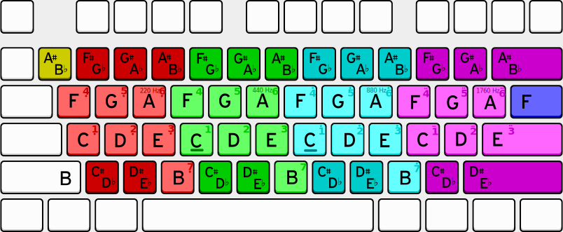

There are lots of online keyboard pianos out there, but I wanted one where:

1. The sounds are pure tones - sine waves - so I can play around with harmonics.
2. The sounds are sustained as long as the key is held down.
3. The notes are laid out in a way that "feels right" on a qwerty keyboard, instead of just trying to copy the layout of a piano.

Keyboard svg modified from [here](https://commons.wikimedia.org/wiki/File:ANSI_US_QWERTY_(Windows)_Enter_Return.svg).

This works best in Chrome, using a keyboard with n-key rollover.
